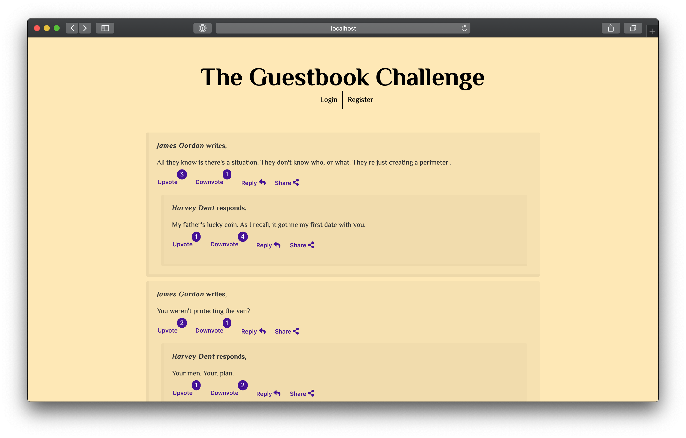
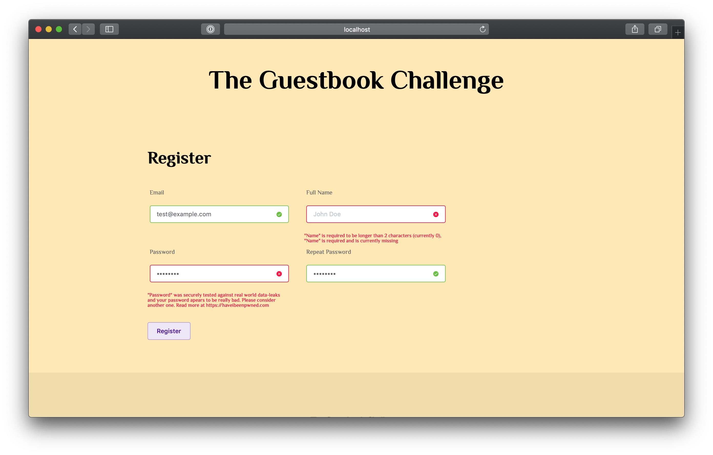
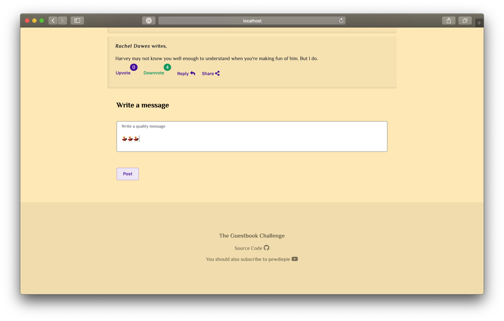
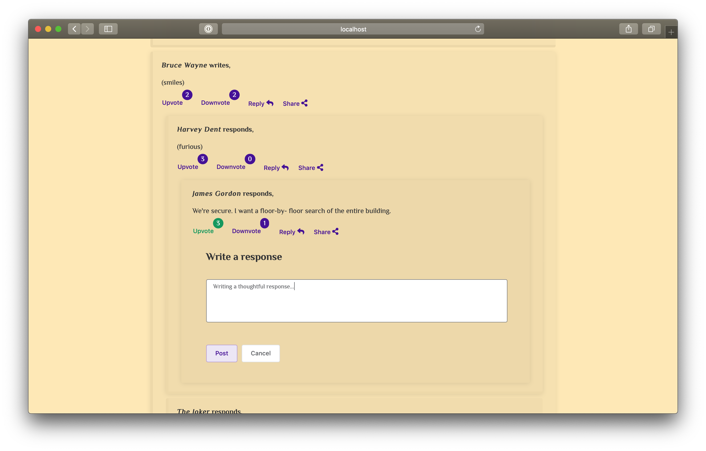

<p align="center">
    
</p>

<h1 align="center">Detectify Guestbook Challenge</h1>

<p align="center">
    
</p>

## About this project

This is a coding challenge for [Detectify](http://detectify.com/). The challenge is to build a guestbook in PHP without any 3rd party framework.

## Demo

A live demo can be viewed at [https://detectify-guestbook.kristoffersson.org](https://detectify-guestbook.kristoffersson.org)

## Features

- User can register
- User can log in
- User can post a message
- User can reply to a message
- User can up- and downvote messages

## Overview

```
src
├── Helpers/
├── Http                        # A lightweight http router framework
│   ├── Controllers/            # Responds to given routes
│   ├── Exceptions/             # Various high level exceptions
│   ├── Request.php             # Request object
│   ├── Responses/              # Different response datatype
│   ├── Router.php              # The core of the http router
│   ├── Routes                  # Supported request methods
│   │   ├── GET.php
│   │   ├── POST.php
│   │   └── ...
│   ├── ...
│   └── Validation              # Request validation framework
│       ├── Exceptions/
│       ├── RuleBuilder.php     # Easy rule creation
│       ├── Rules/              # Rules for validating emails, passwords etc.
│       └── Validation.php
└── Models                      # The applications models
    ├── Cookie.php
    ├── Message.php             # Message model, authored by, text, votes etc.
    ├── User.php
    └── ...
```

```
resources
├── html/                       # Html templates
├── js
│   ├── app.js                  # Javascript entrypoint
│   └── components              # Vue components
│       ├── Forms/              # Various forms, such as login, register etc.
│       ├── Messages/           # Displaying messages
│       ├── Page/               # Page elements, footers, headers etc.
│       └── Text/               # Smaller text components
└── sass
    ├── app.scss                # Main Sass file
    ├── element-theme.scss      # ElementUI variables
    └── variables.scss          # Sass variables
```

## Build

> **Verified to work with**: PHP `7.1.19` node.js `v11.6.0` npm `6.5.0`

### Locally

Download dependencies and build application

```bash

git clone git@github.com:nattvara/detectify-guestbook.git && cd detectify-guestbook/

# install php dependencies
composer install

# build frontend
npm install
./node_modules/element-theme/bin/element-theme -c resources/sass/element-theme.scss -o resources/sass/element-theme
npm run build

# to compile assets on the fly
npm run dev

```

Adjust environment variables to suit your environment

```bash

cp .env.php.example .env.php

```

```php
putenv('env=production');                                                // production|development
putenv('host=127.0.0.1');                                                // database hostname
putenv('username=root');                                                 // database username (should probably not be root)
putenv('password=root');                                                 // database password
putenv('port=3306');                                                     // database port
putenv('db=guestbook');                                                  // application database name
putenv('pwnedpasswords_endpoint=https://api.pwnedpasswords.com/range/'); // pwnedpasswords endpoint, read more at https://haveibeenpwned.com/API/v2
putenv('message_reply_limit=5');                                         // maximum depth allowed for replies to a message

```

Setup the database

```bash

# with data
php ./database/seeder.php

# with empty database
php ./database/setup.php

```

Start the development server

```bash

php -S localhost:9000 ./public/router.php

```

#### Run the testsuite

```bash

$ ./vendor/bin/phpunit

```

If database credentials in `phpunit.xml` are not valid and connection is refused, tests that rely on the database will be skipped

```console
$ ./vendor/bin/phpunit
PHPUnit 7.5.1 by Sebastian Bergmann and contributors.

....SSSSSSSSSS.........SSSSSSSSSSSSS                              36 / 36 (100%)

Time: 147 ms, Memory: 4.00MB

OK, but incomplete, skipped, or risky tests!
Tests: 36, Assertions: 15, Skipped: 23.

```

### Remote Server

> The repo includes an example file for [Deployer](https://github.com/deployphp/deployer). This is configured for an ubuntu server (connecting over SSH using a `.pem` file) with Apache and MySQL installed and a user account `ubuntu` that has write permissions to `/var/www/[YOUR HOST NAME]`

The deployment script is only a simple example and may not suit your environment, update the deployment script accordingly.

Copy `deploy.php.example` to `deploy.php`

Replace host name with your host

```php
host('[YOUR HOST NAME]')
    ->stage('production')
    ->user('ubuntu')
    ->identityFile('[/path/to/.pem]')
    ->set('deploy_path', '/var/www/[YOUR HOST NAME]')
    ->set('branch', 'master');

```

To deploy, run the following in your project root, specify your host using the `--host` option

```console

$ ./deploy deploy --hosts detectify-guestbook.kristoffersson.org
✈︎ Deploying master on detectify-guestbook.kristoffersson.org
✔ Executing task deploy:prepare
✔ Executing task deploy:lock
✔ Executing task deploy:release
➤ Executing task deploy:update_code
✔ Ok
✔ Executing task npm:install
✔ Executing task compile:assets
✔ Executing task deploy:shared
➤ Executing task deploy:vendors
✔ Ok
✔ Executing task deploy:writable
✔ Executing task deploy:symlink
✔ Executing task deploy:unlock
✔ Executing task cleanup

```

Note, that this will not create the database. To create it with or without data, run

```bash

# with empty database
./deploy database:setup --hosts [YOUR HOST NAME]

# with data
./deploy database:seed --hosts [YOUR HOST NAME]

```

## Dependencies

### PHP

The PHP projects goal is to use the minimum amount of dependencies. The only dependencies are used for testing and deployment.

> guzzlehttp/guzzle is used in the production code, due to it's ease of integration into mocking HTTP requests

- [phpunit/phpunit](https://github.com/sebastianbergmann/phpunit)
- [mockery/mockery](https://github.com/mockery/mockery)
- [guzzlehttp/guzzle](https://github.com/guzzle/guzzle)
- [deployer/deployer](https://github.com/deployphp/deployer)
- [deployer/recipes](https://github.com/deployphp/recipes)

### NPM

Se the [package.json file](package.json)

## Screenshots

> Verified on **macOS 10.14.2** with `Firefox 64` `Safari 12` `Chrome 71` and **Windows 10** with `Chrome 71` `Internet Explorer 11` `Microsoft Edge 42`

### Browse messages



### Sign up



### Post a message



### Respond to messages



## License

MIT © Ludwig Kristoffersson

See [LICENSE file](LICENSE) for more information
